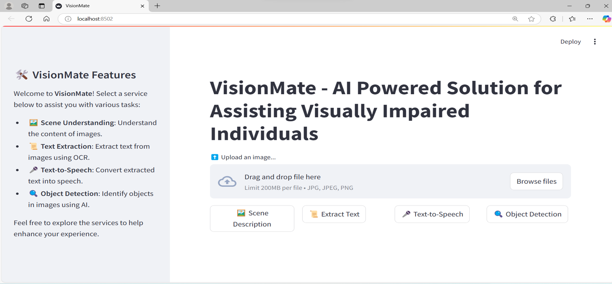
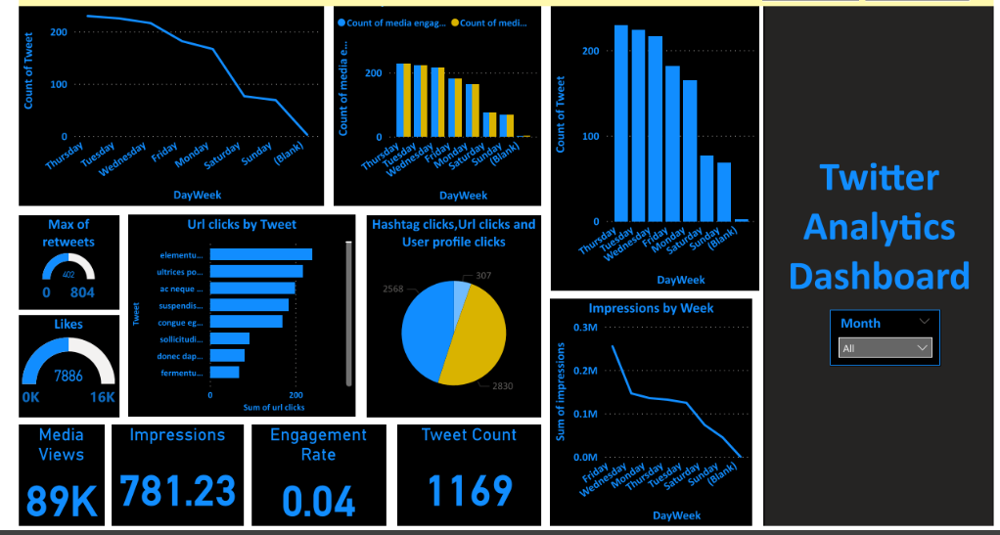

<h1 align="left">Hi 👋! My name is Aarsha Anil and I'm a AI Engineer, from India.</h1>

  
  

  
  
  
  
  
  
  
  
  
  
  
  
  
  
  
  
  
  
  
  
  
  
  
  
  
  
  

###

  
  
  
  

###

 

###

  
  

###

###

###
# ABOUT ME

I am a B.Tech graduate in AI and Data Science from Vimal Jyothi Engineering College with a deep passion for leveraging AI and data-driven insights to solve real-world challenges. With expertise in data science, machine learning, and generative AI, I thrive on creating innovative solutions and uncovering actionable insights. My goal is to apply cutting-edge AI technologies to develop impactful applications that drive meaningful change.

## 🚀 Tech Stack

---

## Technical Skills  
- **Programming Languages**: Python, R  
- **Data Analysis & Manipulation**: pandas, NumPy  
- **Machine Learning & AI**: Scikit-learn, TensorFlow, PyTorch  
- **Generative AI**: Hugging Face, OpenAI GPT  
- **Data Visualization**: Matplotlib, Seaborn, Power BI, Tableau  
- **Databases & Query Languages**: SQL, MongoDB  
- **Tools & Platforms**: Jupyter Notebook, Google Colab, Git  
- **Cloud & Deployment**: AWS (S3, EC2), Docker  

---

## Soft Skills  
- **Communication**: Ability to present data-driven insights effectively to stakeholders.  
- **Teamwork**: Proven experience working collaboratively in team environments to achieve project goals.  
- **Problem-Solving**: Skilled in analyzing complex problems and providing actionable solutions using data-driven approaches.  
- **Adaptability**: Quick to learn new technologies and adapt to evolving challenges in the field of AI and Data Science.  
- **Critical Thinking**: Expertise in identifying key issues and evaluating alternative solutions effectively.
  
## Education 
- **Degree:** B.Tech in Artificial Intelligence and Data Science.
- **Institution:** Vimal Jyothi Engineering College.
- **Graduation Year:** 2024
- **CGPA:** 9.08/10

## Experience

### Data Science Intern  
**Innomatics Research Labs** – Remote
*September 2024 – December 2024*  
- Explored advanced techniques in **Exploratory Data Analysis (EDA)** and **Data Analytics**.  
- Gained proficiency in implementing **machine learning algorithms** to solve real-world problems.  
- Acquired hands-on experience with **Generative AI (GenAI)** technologies, learning their applications and implementation.  
- Worked on **GenAI projects**, leveraging state-of-the-art tools to deliver impactful solutions.  
**Tools & Technologies**: Python, pandas, Scikit-learn, TensorFlow, Hugging Face  

---

### Data Science Intern  
**Coapps Development Solutions Pvt Ltd** – Remote  
*February 2024 – April 2024*  
- Contributed to multiple **data science projects**, applying machine learning models and statistical analysis to derive actionable insights.  
- Performed **data cleaning and preprocessing** to ensure high-quality inputs for models.  
- Presented findings and visualizations to team members, supporting data-driven decision-making.  
**Tools & Technologies**: Python, SQL, Power BI, pandas

## Projects

### 1. [End-to-End Fine-tuning LLM Models with Lamini AI Cloud](https://github.com/899-12/End-To-End-Finetuning-LLM-Models-With-Lamini-AI-Cloud)
**Technologies:** Python, Lamini AI, LLM Fine-Tuning, LoRA, Generative AI

**Description:**  
This project demonstrates how to fine-tune large language models (LLMs) using Lamini AI Cloud. The project utilizes LoRA (Low-Rank Adaptation) to efficiently fine-tune models for specific use cases without the need for excessive computational resources. The aim was to showcase how advanced AI models can be adapted to specialized domains with minimal cost.

**Key Tasks:**
- Fine-tuned LLM models using Lamini AI Cloud.
- Implemented LoRA for efficient training of models.
- Experimented with different hyperparameters to optimize performance.

**Key Learnings:**
- Hands-on experience with Lamini AI Cloud for fine-tuning LLMs.
- Gained insights into efficient model training using LoRA.
- Enhanced understanding of generative AI techniques and deployment.

---

### 2. [Automated Blog Content Generation from YouTube Videos](https://github.com/899-12/Automated-Blog-Content-Generation-from-YouTube-Videos)
**Technologies:** Python, YouTube API, Natural Language Processing (NLP), OpenAI GPT

**Description:**  
This project automates the process of generating blog content from YouTube videos. By extracting key information and summarizing video transcripts using NLP techniques, it generates well-structured blog posts. The project leverages OpenAI GPT to ensure the generated content is coherent and engaging for readers.

**Key Tasks:**
- Extracted video transcripts using the YouTube API.
- Processed and summarized video content using NLP.
- Generated blog posts using OpenAI GPT for coherent and relevant content.

**Key Learnings:**
- Experience in using YouTube API for data extraction.
- Applied NLP techniques for summarization and content generation.
- Explored the integration of generative AI tools for content creation.

---

### 3. [RAG Document Q&A with Nvidia NIM and Langchain](https://github.com/899-12/RAG-Document-Q-A-With-Nvidia-NIM-And-Langchain)
**Technologies:** Python, Langchain, Nvidia NIM, Retrieval-Augmented Generation (RAG)

**Description:**  
In this project, I developed a retrieval-augmented generation (RAG) system for answering document-based questions using Nvidia NIM and Langchain. This system enhances the model's ability to generate accurate answers by retrieving relevant context from a document before generating a response, improving the overall performance for specialized Q&A tasks.

**Key Tasks:**
- Integrated Nvidia NIM for document-based question answering.
- Utilized Langchain for managing the RAG pipeline.
- Conducted tests on various documents to evaluate the model's accuracy.

**Key Learnings:**
- Hands-on experience with Nvidia NIM and Langchain for building advanced Q&A systems.
- Improved knowledge of RAG systems and their effectiveness in document-based Q&A.

---

### 4. [Blog Generation Using AWS Bedrock and Amazon S3](https://github.com/899-12/Blog-Generation-Using-AWS-Bedrock-and-Amazon-S3)
**Technologies:** Python, AWS Bedrock, Amazon S3, Generative AI

**Description:**  
This project automates the process of blog generation using AWS Bedrock for generative AI. The blog posts are stored and managed efficiently with Amazon S3. The project focuses on using cloud-based AI services to scale content creation and manage large volumes of generated content.

**Key Tasks:**
- Leveraged AWS Bedrock for generative AI to create blog content.
- Utilized Amazon S3 for content storage and management.
- Developed an automated pipeline for blog generation and management.

**Key Learnings:**
- Gained experience in using AWS Bedrock for generative AI tasks.
- Learned how to integrate Amazon S3 for content storage and management.
- Explored cloud solutions to scale and automate content generation.

---

### 5. [Finetuning Using Google Gemma Model](https://github.com/899-12/FINETUNING-USING-GOOGLE-GEMMA-MODEL)
**Technologies:** Python, Google Gemma, Model Fine-Tuning

**Description:**  
This project involves fine-tuning Google’s Gemma model to create more accurate and specialized models. The focus was on adapting the Gemma model to a particular domain or task by training it with a custom dataset, improving its performance and adaptability.

**Key Tasks:**
- Fine-tuned Google Gemma model on a custom dataset.
- Conducted hyperparameter optimization to improve model performance.
- Evaluated the fine-tuned model’s ability to handle domain-specific tasks.

**Key Learnings:**
- Learned how to fine-tune pre-trained models for specialized tasks.
- Gained practical experience in model optimization and performance evaluation.

---

### 6. [YouTube Video and Website URL Content Summarization GEN-AI App](https://github.com/899-12/Youtube-Video-And-Website-Url-Content-Summarization-GEN-AI-App)
**Technologies:** Python, Generative AI, Natural Language Processing (NLP)

**Description:**  
This project focuses on developing an AI-powered application that summarizes content from YouTube videos and website URLs. The app uses advanced NLP and generative AI techniques to provide concise summaries while retaining the essential information.

**Key Tasks:**
- Developed a summarization pipeline using generative AI for YouTube videos and website URLs.
- Extracted key content from URLs and video transcripts.
- Generated meaningful and concise summaries of the extracted content.

**Key Learnings:**
- Enhanced skills in generative AI for content summarization.
- Gained practical knowledge of processing diverse content formats (video, website).
- Applied NLP methods for text summarization and information extraction.

---

### 7. [End-to-End Search Engine GEN-AI App using Tools and Agent with Open Source LLM](https://github.com/899-12/-End-To-End-Search-Engine-GEN-AI-App-using-Tools-And-Agent-With-Open-Source-LLM)
**Technologies:** Python, Langchain, Open Source LLMs, Generative AI

**Description:**  
This project implements an end-to-end search engine using generative AI tools and agents powered by an open-source LLM. The goal is to enhance traditional search capabilities by integrating advanced AI to understand the intent behind queries and retrieve more relevant results.

**Key Tasks:**
- Developed a search engine using open-source LLMs for query understanding.
- Integrated generative AI tools to enhance search results with context-aware responses.
- Experimented with different models and configurations to optimize search relevance.

**Key Learnings:**
- Hands-on experience with open-source LLMs for advanced search applications.
- Gained understanding of integrating generative AI in search engine tasks.
- Learned how to optimize AI-powered search engines for better user experience.

---

### 8. [Enhanced Q-A Chatbot with OpenAI Using Streamlit](https://github.com/899-12/Enhanced-Q-A-Chatbot-with-OpenAI-Using-Streamlit)
**Technologies:** Python, OpenAI GPT, Streamlit, Generative AI

**Description:**  
This project enhances a Q&A chatbot using OpenAI GPT, deployed through a user-friendly interface built with Streamlit. The chatbot is designed to provide dynamic and context-aware responses, improving user interaction and experience.

**Key Tasks:**
- Integrated OpenAI GPT for intelligent, context-aware responses.
- Developed an interactive user interface with Streamlit.
- Optimized the chatbot for handling various types of user queries.

**Key Learnings:**
- Learned how to integrate OpenAI GPT with Streamlit for building interactive applications.
- Gained experience in designing user-friendly AI-powered applications.
- Improved skills in conversational AI and chatbot development.

---

### 9. [Conversational RAG with PDF Uploads and Chat History](https://github.com/899-12/Conversational-RAG-with-PDF-Uploads-and-Chat-History)
**Technologies:** Python, Langchain, Retrieval-Augmented Generation (RAG), PDF Parsing

**Description:**  
This project focuses on creating a conversational system that utilizes Retrieval-Augmented Generation (RAG) for PDF document uploads and chat history. The system answers questions based on the content of the uploaded PDFs and the history of the conversation.

**Key Tasks:**
- Implemented a RAG-based approach to handle document-based questions.
- Allowed PDF uploads for dynamic document processing.
- Integrated chat history for context-aware responses.

**Key Learnings:**
- Gained hands-on experience with Langchain and RAG systems.
- Learned how to handle and process PDFs for conversational applications.
- Developed skills in designing AI systems with memory and context.

---

### 10. [Next Word Prediction Using LSTM-RNN](https://github.com/899-12/Next-Word-Prediction-using-LSTM-RNN)
**Technologies:** Python, LSTM, RNN, Deep Learning

**Description:**  
This project implements a next-word prediction system using Long Short-Term Memory (LSTM) and Recurrent Neural Networks (RNN). The system predicts the next word in a sentence based on the context provided by the input text.

**Key Tasks:**
- Built an LSTM-based model for next-word prediction.
- Trained the model on large text datasets.
- Evaluated model accuracy and refined its predictions.

**Key Learnings:**
- Gained expertise in training deep learning models using LSTM and RNN.
- Learned how to preprocess text data for deep learning tasks.
- Enhanced knowledge of sequential models for natural language processing.

---

### 11. [FlickPicks Personalized Movie Recommendations Using Collaborative Filtering](https://github.com/899-12/FlickPicks-Personalized-Movie-Recommendations-using-Collaborative-Filtering)
**Technologies:** Python, Collaborative Filtering, Recommender Systems

**Description:**  
This project builds a personalized movie recommendation system using collaborative filtering techniques. It analyzes user preferences and suggests movies based on similar tastes, helping users discover new content tailored to their interests.

**Key Tasks:**
- Developed a recommendation system using collaborative filtering algorithms.
- Implemented data preprocessing and matrix factorization techniques.
- Evaluated the system’s performance and accuracy of recommendations.

**Key Learnings:**
- Developed a deeper understanding of collaborative filtering in recommendation systems.
- Gained hands-on experience with building recommender systems.
- Applied data preprocessing and evaluation techniques for recommender models.

---

### 12. [VisionMate AI](https://github.com/899-12/VisionMate-AI)
**Technologies:** Python, Computer Vision, Deep Learning, OpenCV, TensorFlow

**Description:**  
VisionMate AI is an intelligent computer vision application that detects and classifies objects within images. Using deep learning and computer vision techniques, it can recognize various objects and categorize them accurately.

**Key Tasks:**
- Built a deep learning model for object detection and classification.
- Trained the model using labeled datasets for various objects.
- Deployed the model to an interactive application.

**Key Learnings:**
- Developed skills in deep learning for computer vision tasks.
- Learned how to use OpenCV and TensorFlow for image processing.
- Gained practical experience in deploying computer vision models.

---

### 13.[Enhancing Campus Security Through Abnormal Behavior Detection Using Deep Learning](https://github.com/899-12/Enhancing-campus-security-through-abnormal-behavior-detection-using-Deep-learning)
**Technologies:** Python, Deep Learning, CNN, OpenCV, TensorFlow, CCTV, Anomaly Detection

**Description:**
This project focuses on enhancing campus security by detecting abnormal behavior in real time through CCTV cameras. Using Convolutional Neural Networks (CNNs), the system is designed to analyze video footage, identify unusual patterns, and alert security personnel in case of any suspicious activity.

**Key Tasks:**

Collected and preprocessed CCTV camera footage data.
Built a deep learning model using CNNs for abnormal behavior detection.
Trained the model to identify common and uncommon behaviors in the footage.
Integrated the model into a real-time surveillance system for live detection.

**Key Learnings:**

Gained hands-on experience with CNNs for video and image analysis.
Learned how to process and analyze real-time video data using OpenCV and TensorFlow.
Developed skills in anomaly detection in security systems, which can be applied to various real-world scenarios.
Gained practical knowledge of how to implement deep learning models for safety and surveillance applications.
### 14.[Real time Twitter Analytics Dashboard-Power BI](https://github.com/899-12/Twitter-Data-Analytics)
- Worked on Twitter data from Data World, where I performed an ETL (Extract, Transform, Load) process. This involved extracting the data, cleaning it by removing null or blank values, and transforming text fields into numerical types for easier analysis. The cleaned data was then loaded for visualization. I created a comprehensive dashboard using various charts, including gauge, pie, column bar, card, and line charts, to provide clear insights from the data.
Worked on Twitter data from Data World, where I performed an ETL (Extract, Transform, Load) process. This involved extracting the data, cleaning it by removing null or blank values, and transforming text fields into numerical types for easier analysis. The cleaned data was then loaded for visualization. I created a comprehensive dashboard using various charts, including gauge, pie, column bar, card, and line charts, to provide clear insights from the data.
**Skills:** Extract, Transform, Load (ETL) · Visualization · Chart · Microsoft Power BI · Data Analysis

## Certifications & Courses:

  **1. BCG - GenAI Job Simulation**  
 
  Issued by: **Forage**  
  Date: November 14,2024
  [View Certificate](assets/img/forage.pdf)
  

**2. Complete Generative AI Course With Langchain and Huggingface**

 Issued by: **Udemy**  
 
 Date: December 16,2024
 [View Certificate](assets/img/1734360966786.pdf)

**3. Data Science Job Simulation**

 Issued by: **Forage**  
 
 Date: December 16,2024
 [View Certificate](assets/img/forage1.pdf)

**4. Microsoft Technology Associate Introduction to Programming using Python**
  

 Issued by: Microsoft  
 Date: March 19, 2022  
 [View Certificate](assets/img/Programming.pdf)

**5. Microsoft Certified: Azure AI Fundamentals**
  
 Issued by: **Microsoft**  
 
 Date: August 2022
 [View Certificate](assets/img/Azure_AI.pdf)

 **6. Google Cybersecurity**

 Issued by: **Google**  
 
 Date: August 3,2024
 [View Certificate](assets/img/cybersecurity.pdf)
 
 **7. Google AI Essential**

 Issued by: **Google**  

 Date: June 12,2024
 [View Certificate](assets/img/AIessentials.pdf)

**8. Google Data Analytics**

 Issued by: **Google**  

 Date: October 24,2024
 [View Certificate](assets/img/data.pdf)

# Blogs & Articles
 **Title: Evolution of Language Representation Techniques: A Journey from BoW to GPT**
- Language representation, also known as text vectorization or feature extraction, is the process of converting textual data into a numerical format that computers can understand. Since machines cannot interpret text in its raw form, transforming words and phrases into numerical vectors allows for mathematical processing and model-building.

- Vectorization essentially turns text into arrays of numbers that capture semantic meaning and syntactic information. This enables machines to recognize word relationships, perform analysis, and execute tasks like classification, sentiment analysis, and translation.
- **Link:[Evolution of Language Representation Techniques: A Journey from BoW to GPT](https://medium.com/@aarshaanil2001/evolution-of-language-representation-techniques-a-journey-from-bow-to-gpt-95ce0209f111)**

**Title: Hacking the System Design: How Search Engines Understand and Deliver Results**
- Search engines are the key to accessing vast amounts of information over the web. In order to provide users with access to the information they are looking for, search engines are designed with a special software component called an indexer that reads through all the text on web pages and creates entries into a search index (also called catalog or directory). When you search, like this one, a relevance engine returns results from your query against its searchable index. Each time you perform a search, whatever engine you use queries its index to find the most relevant items based on some criterion.
- **Link:[Hacking the System Design: How Search Engines Understand and Deliver Results](https://medium.com/@aarshaanil2001/hacking-the-system-design-how-search-engines-understand-and-deliver-results-09288d9d6914)**

# Resume
- [Download My Resume](assets/img/Aarsha_Anil_Application_pdf.pdf)
  
## Contact

- **Gmail:** [aarshaanil2001@gmail.com](mailto:aarshaanil2001@gmail.com)
- **GitHub:** [https://github.com/899-12](https://github.com/899-12)
- **LinkedIn:** [https://www.linkedin.com/in/aarsha-anil-20744222a/](https://www.linkedin.com/in/aarsha-anil-20744222a/)
